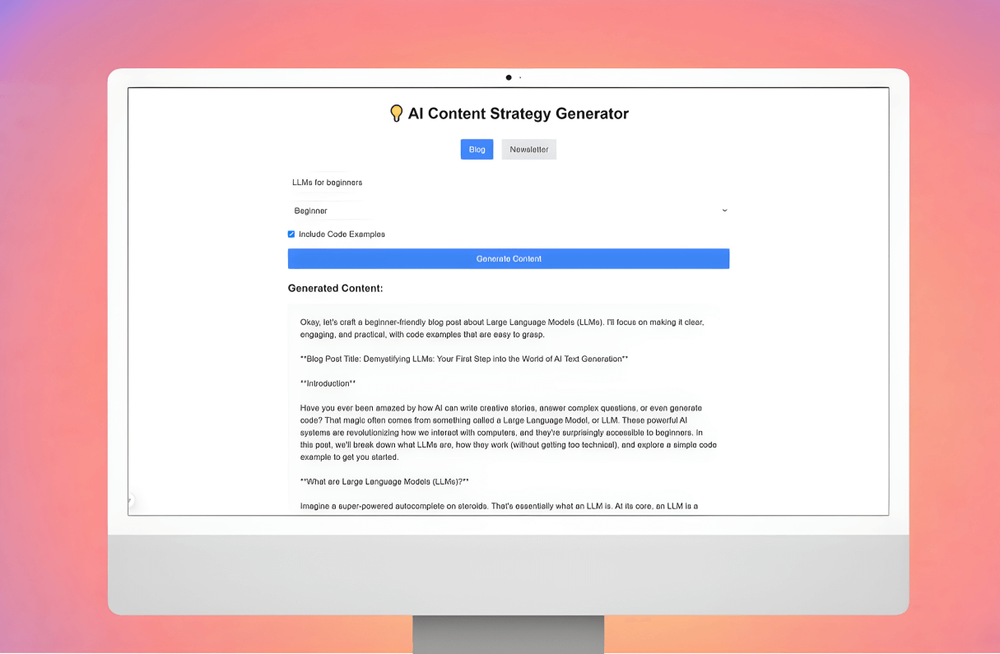

# AI Content Strategy Generator 💡

A modern AI powered web application built with Next.js that helps content creators generate customized blog posts and newsletters using Google Gemini models - prototyped with Google AI Studio.

## Features

- **Dynamic Content Types**: Switch between blog posts and newsletter generation
- **Customizable Options**:
  - Blog posts: Select technical level and toggle code examples
  - Newsletters: Choose from multiple section types including Featured Technical Content, Industry Insights, Quick Tips, and Resource Roundup
- **Modern UI**: Clean and responsive interface built with Tailwind CSS
- **Content Export**: Download generated content as markdown files
- **Real-time Generation**: Instant content generation with loading states and error handling

## Tech Stack

- [Next.js](https://nextjs.org/) - React framework for production
- [Tailwind CSS](https://tailwindcss.com/) - Utility-first CSS framework
- [React](https://reactjs.org/) - UI library
- API integration for AI content generation

## Getting Started

### Prerequisites

- Node.js 14.0 or later
- npm or yarn
